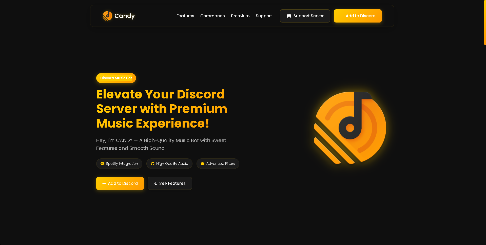
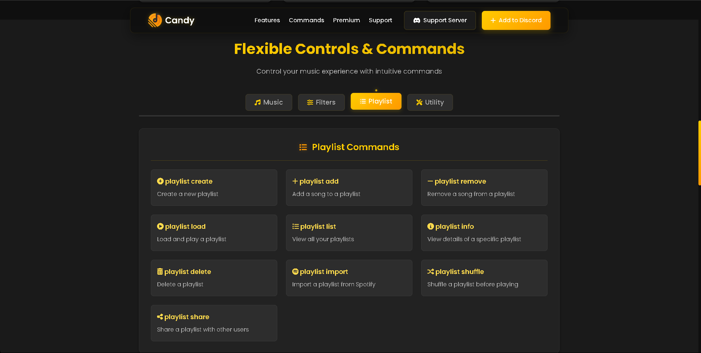
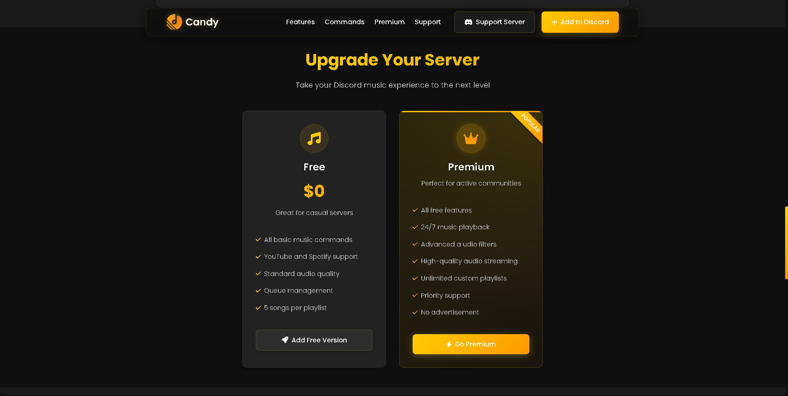

# Discord Bot Website Template

A modern, responsive website for the Discord music bot. This website showcases the bot's features, commands, and premium offerings with a sleek, user-friendly interface.

## 🌟 Features

- **Responsive Design**: Fully responsive layout that works on all devices
- **Modern UI**: Clean and intuitive user interface with smooth animations
- **Command Showcase**: Interactive display of bot commands by category
- **Premium Plans**: Showcase of free and premium subscription options
- **Legal Pages**: Comprehensive Terms of Service and Privacy Policy
- **Spotify Authentication**: Callback page for Spotify API integration
- **Animated Elements**: Engaging animations and interactive elements

## 🚀 Installation

1. Clone the repository:
   ```bash
   git clone https://github.com/AnomusLY/Discord-Bot-Website-Template.git
   ```

2. Navigate to the project directory:
   ```bash
   cd Discord-Bot-Website-Template
   ```

3. Open the project in your preferred code editor.

4. Launch the website using a local server or by opening `index.html` in your browser.

## 💻 Usage

The website consists of several pages:

- **Home Page (`index.html`)**: Main landing page showcasing the bot's features
- **Terms of Service (`terms.html`)**: Legal terms for using the bot
- **Privacy Policy (`privacy.html`)**: Privacy information and data handling policies
- **Callback Page (`callback.html`)**: Handles Spotify authentication callbacks

## 🛠️ Technologies Used

- **HTML5**: Semantic markup for structure
- **CSS3**: Custom styling with variables and modern features
- **JavaScript**: Interactive elements and animations
- **Font Awesome**: Icon library
- **Google Fonts**: Typography (Poppins)

## 🤝 Contributing

Contributions are welcome! If you'd like to contribute to this project, please follow these steps:

1. Fork the repository
2. Create a new branch (`git checkout -b feature/amazing-feature`)
3. Make your changes
4. Commit your changes (`git commit -m 'Add some amazing feature'`)
5. Push to the branch (`git push origin feature/amazing-feature`)
6. Open a Pull Request

## 📜 License

This project is licensed under the MIT License - see the LICENSE file for details.

## 📞 Contact

- **Discord Server**: [Join our community](https://discord.gg/rp4H4YPvwJ)
- **GitHub**: [AnomusLY](https://github.com/AnomusLY)

## 📸 Screenshots





---

© 2025 Anomus.LY. All rights reserved.
